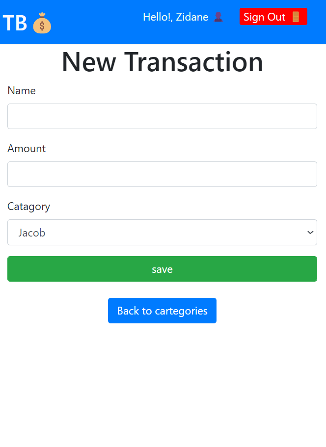

 

# Track Budget app

 A mobile application where the user can create new accounts, sign in, create different cartegories and check the transactions he/she has done in the past. This is a great Ruby on Rails app to help you track your money and take records of your expenditure!


# Quick view





> This project is a blog that allows the user to create cartegory, add a transaction and view transaction made my each cartegory creator. The whole project is based on the ERDiagram below:


## Built With

- [x] Ruby (programming language)
- [x] Rails (framework)
- [x] PostgreSQL (database)
- [x] Linters: [Rubocop](https://rubocop.org/)
- [x] Linters: [Stylent](https://stylelint.io/)
- [x] Visual Studio Code (code editor)
- [x] RSpec (unit testings) 
- [x] Capybara (integration testings)

## Getting Started

To get a local copy up and running follow these simple steps.

### Prerequisites

- [x] A web browser like Google Chrome.
- [x] A code editor like Visual Studio Code with Git and Ruby.

You can check if Git is installed by running the following command in the terminal.
```
$ git --version
```

Likewise for Ruby installation.
```
$ ruby --version && irb
```

### Setup

Clone the repository using the GitHub link provided below.

### Install

In the terminal, go to your file directory and run this command.

```
$ git clone https://github.com/aneallaryea100/budget_app.git
```
```
$ cd Blog-App
```
Run the following command to install all dependencies.
```
$ bundle install
```
```
$ code .
```

### Database

To create your local Database
```
$ rails db:create
```
```
$ rails db:migrate
```
To populate your Database
```
$ rails db:seed
```

### Run tests

Run the local server with:
```
$ rails server
```
Open it by accessing http://localhost:3000/ on your browser.

### Run tests

To install rspec, in the terminal kindly run this command

```
$ gem install rspec
```

To run tests, please run this command

```
$ rspec ./spec/#{filename}_spec.rb 
```

To run all tests, please run this command
```
or $ spec  
```

### Usage

Kindly modify the files as needed.

## Author

👤 **Aneal Laryea** 💡🧑‍💻
* Github: [@aneallaryea](https://github.com/aneallaryea100)
* LinkdIn: [@aneallaryea](https://www.linkedin.com/in/nii-aneal-84ba7a147)
* Twitter: [@aneallaryea](https://twitter.com/AnealLaryea)

## 🤝 Contributing

Contributions, issues, and feature requests are welcome!

## Show your support

Give a ⭐️ if you like this project!

# loom video
- This video explains the features of the application and shows a piece of code I am proud of.
[loom video](https://www.loom.com/share/8a4be559f47b4fce96e71e22ce8e7f01)

## Design Template

- I give credit to [Gregoire Vella on Behance](https://www.behance.net/gregoirevella) the author of the [original design](https://www.behance.net/gallery/19759151/Snapscan-iOs-design-and-branding?tracking_source=)


## 📝 License

This project is [MIT](./MIT.md) licensed.